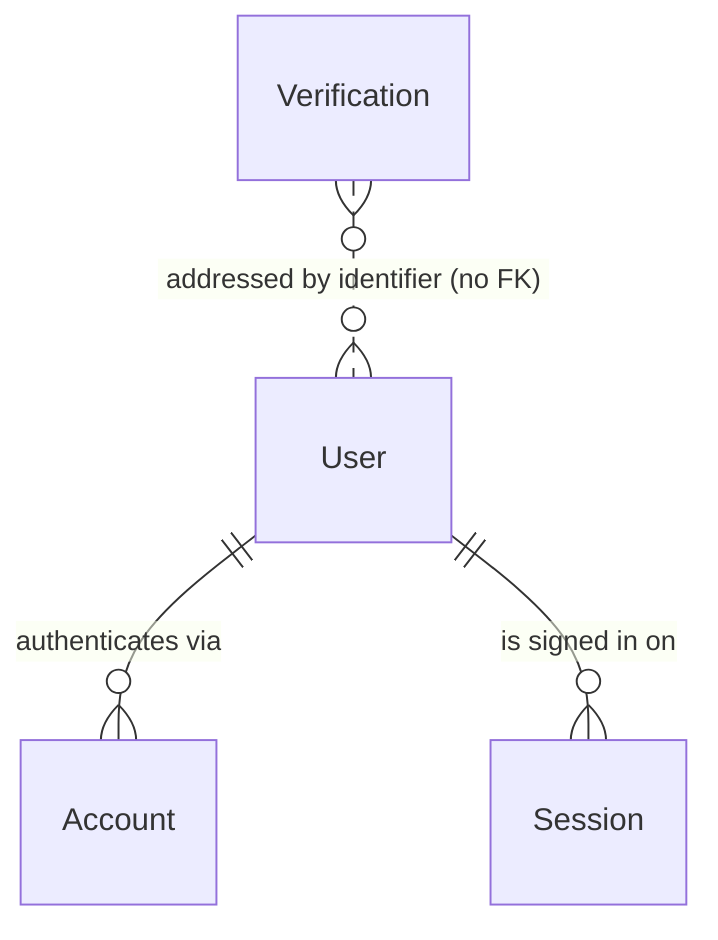

# NEURA — Authentication

Phase 3. Email + password authentication built on **Better Auth 1.7.2**, backed
by the existing PostgreSQL database and Prisma 7 client.

Scope: registration, sign-in, sign-out, session management and route
protection. OAuth, email verification delivery and password reset delivery are
explicitly out of scope — §9, §10 and §11 explain where each one plugs in.

---

## 1. Architecture

```
Browser
  │
  │  lib/auth/client.ts   (createAuthClient — signUp / signIn / signOut / useSession)
  ▼
/api/auth/[...all]        (toNextJsHandler — every Better Auth endpoint)
  │
  ▼
lib/auth/auth.ts          (the single betterAuth() instance: all policy lives here)
  │
  ├── prismaAdapter(prisma)  →  reuses the Phase 1 Prisma singleton
  ▼
PostgreSQL                (users · accounts · sessions · verifications)
```

### Module layout

| File | Responsibility |
| --- | --- |
| [lib/auth/auth.ts](../lib/auth/auth.ts) | The one Better Auth instance and every policy decision. |
| [lib/auth/session.ts](../lib/auth/session.ts) | Server-side session helpers: `getSession`, `getCurrentUser`, `requireSession`, `redirectIfAuthenticated`. |
| [lib/auth/client.ts](../lib/auth/client.ts) | Browser client. Holds no policy. |
| [lib/auth/index.ts](../lib/auth/index.ts) | Server-safe barrel. Deliberately does **not** re-export the client. |
| [app/api/auth/[...all]/route.ts](<../app/api/auth/[...all]/route.ts>) | Mounts Better Auth. No custom auth endpoints exist. |
| [proxy.ts](../proxy.ts) | Cheap optimistic redirects. |
| [features/auth/](../features/auth) | Forms, Zod schemas, error mapping. |

The repository has no `src/` directory; these paths follow the layout
established in Phase 1.

**Configuration lives in exactly one place.** `auth.ts` holds the full config
inline rather than splitting it into a separate `auth-config.ts` that would
have a single consumer — that is also how Better Auth's own documentation
structures it. No component talks to Better Auth directly; they go through
`lib/auth/session.ts` on the server or `lib/auth/client.ts` in the browser.

---

## 2. Database relationships

Phase 2's `User` was **extended, not replaced**. One column was added; nothing
was renamed, dropped, or re-typed, and every Phase 2 foreign key still points at
`users.id`.



### Field mapping

Better Auth's required user fields are satisfied by columns NEURA already had,
via `user.fields` in `auth.ts`:

| Better Auth logical field | NEURA column | Note |
| --- | --- | --- |
| `name` | `display_name` | Mapped. |
| `image` | `avatar_url` | Mapped. |
| `email` | `email` | Already present, `citext`. |
| `createdAt` / `updatedAt` | same | Already present. |
| `emailVerified` | `email_verified` | **The only column added.** |
| `username` | `username` | Declared as an `additionalField` so sign-up can set it. |

`bio`, `statusText` and `isActive` are unknown to Better Auth and simply keep
their defaults — they are NEURA's, not the auth library's.

### New tables

| Table | Purpose |
| --- | --- |
| `accounts` | One row per authentication method. Email + password is a single row with `provider_id = "credential"` and the password hash in `password`. OAuth adds rows here with **no schema change**. |
| `sessions` | One row per signed-in device. Unique `token`, `expires_at`, plus `ip_address` / `user_agent`. |
| `verifications` | Short-lived tokens for email verification and password reset. Unused this phase; created now so the email phase is a configuration change, not a migration. |

Both `accounts.user_id` and `sessions.user_id` are `ON DELETE CASCADE`:
deleting a user removes their credentials and sessions. (In practice users are
deactivated via `is_active` rather than deleted — Phase 2's `RESTRICT` keys on
authored content make a hard delete impossible for anyone who has posted.)

### Ids

Auth tables use **UUIDv7**, like every other NEURA table. This is not automatic:
Better Auth would otherwise generate a 32-character random string, which is not
a valid UUID and would be rejected by the `@db.Uuid` columns — and `User.id` is
referenced by every Phase 2 foreign key. Setting
`advanced.database.generateId: false` makes Better Auth omit `id` on insert so
Prisma's `@default(uuid(7))` supplies it.

---

## 3. Registration flow

```
RegisterForm
  │ 1. registerSchema.safeParse()   — validates AND normalises
  │                                   (username + email trimmed, lowercased)
  ▼
authClient.signUp.email({ name, email, username, password })
  │
  ▼ POST /api/auth/sign-up/email
  │
  │ 2. databaseHooks.user.create.before  — is the username taken?
  │ 3. Better Auth checks email uniqueness
  │ 4. scrypt hash of the password
  │
  ├─→ INSERT users     (display_name, username, email, is_active=true, …)
  ├─→ INSERT accounts  (provider_id="credential", password=<hash>)
  ├─→ INSERT sessions  (autoSignIn: true)
  └─→ Set-Cookie: neura.session_token + neura.session_data
  │
  ▼ 5. router.push("/app")
```

### Profile bootstrap

`username` is a configured `additionalField`, so it is written **in the same
insert** as the rest of the user. There is no second write and therefore no
window in which a user exists without a username. Verified state after
registration:

| Field | Value |
| --- | --- |
| `displayName` | submitted value |
| `username` | normalised (trimmed, lowercased) |
| `email` | submitted, lowercased |
| `avatarUrl` / `bio` / `statusText` | `null` |
| `isActive` | `true` |
| `emailVerified` | `false` |

No workspace is created — that is Phase 5.

### Username uniqueness is not race-prone

Three layers, and only the last one is authoritative:

1. **Zod** validates *shape* (length, URL-safe characters) and normalises case.
   It never asks the database whether a name is free.
2. **`databaseHooks.user.create.before`** checks availability to produce a
   precise message. This check is *deliberately* allowed to be racy — it grants
   nothing, it only improves the common-case error.
3. **The unique index on `users.username`** is the authority. Two simultaneous
   sign-ups can both pass step 2; exactly one survives step 3, and the loser is
   mapped to the same "username is taken" message.

Because `username` is a `citext` column, `Ada` and `ada` collide in the database
regardless of what the client sent.

---

## 4. Login flow

```
LoginForm
  │ loginSchema.safeParse()   — presence only for the password
  ▼
authClient.signIn.email({ email, password })
  │
  ▼ POST /api/auth/sign-in/email
  │   → look up user by email (citext: case-insensitive)
  │   → verify scrypt hash
  │   → INSERT sessions; Set-Cookie
  ▼
router.push(safeRedirect(?next)) — defaults to /app
```

The login schema checks the password only for **presence**. Applying the
registration rules would reject a valid older password the moment policy
changes, and would let an attacker infer which passwords could exist.

`?next=` is filtered by `safeRedirect`: only same-origin paths are accepted, so
the login page cannot be turned into an open redirect for phishing.

---

## 5. Session management

| Setting | Value | Reason |
| --- | --- | --- |
| `expiresIn` | 30 days | |
| `updateAge` | 1 day | Sliding expiry, refreshed at most daily so session writes stay off the hot path. |
| `cookieCache` | enabled, 5 min | A signed copy of the session in a cookie: most lookups need no database round trip. |
| Cookie prefix | `neura` | `neura.session_token`, `neura.session_data`. |

Sessions are **stateful**: every session is a row in `sessions`. Sign-out
deletes the row, so the session is dead server-side rather than merely forgotten
by the browser — a copied cookie stops working immediately. The cookie cache
does not weaken this: it is signed with `BETTER_AUTH_SECRET`, expires in five
minutes, and the platform layout re-validates against the database once it
lapses.

One row per device means multiple concurrent sessions are supported and a single
device can be revoked without signing the user out everywhere.

`getSession` is wrapped in React's `cache`, so a render pass that consults it
from a layout and a page costs one lookup.

---

## 6. Route protection

Two layers, with distinct jobs.

### Layer 1 — [proxy.ts](../proxy.ts) (optimistic)

Next.js 16 deprecated `middleware.ts` and renamed it to `proxy.ts`; NEURA uses
the current convention.

It checks only whether a session cookie is **present**. It never reads the
database and never validates the cookie, because it runs before every matched
request. Matcher: `/app/:path*`, `/login`, `/register` — `/api/auth/*` is
excluded, since redirecting an auth request would break sign-in itself.

### Layer 2 — [app/(platform)/layout.tsx](<../app/(platform)/layout.tsx>) (authoritative)

`requireSession()` performs the real validation for the whole route group. **This
is the security boundary.** A forged or revoked cookie sails past the proxy and
is rejected here — both cases are verified in §9.

This is one check per navigation, not one per component: the layout guards the
group, and nested pages reuse the cached result.

### Rules

| Route | Anonymous | Authenticated |
| --- | --- | --- |
| `/` | 200 | 200 |
| `/login`, `/register` | 200 | → `/app` |
| `/app/*` | → `/login?next=…` | 200 |

---

## 7. Environment variables

| Variable | Required | Purpose |
| --- | --- | --- |
| `BETTER_AUTH_SECRET` | **Yes** | Signs session cookies and verification tokens. Minimum 32 characters. |
| `BETTER_AUTH_URL` | No | Auth origin. Defaults to `NEXT_PUBLIC_APP_URL`, correct for single-origin deployments. |

Generate the secret with:

```bash
openssl rand -base64 32
```

Rotating it invalidates every active session. Use a different value per
environment and never commit a real one — `.env.example` ships the key with an
**empty** value on purpose, so copying it fails validation loudly instead of
running on a secret that is public in the repository.

Both are declared in [lib/validations/env.ts](../lib/validations/env.ts) and
validated with Zod at startup, like every other NEURA setting. Nothing reads
`process.env` directly.

---

## 8. Security decisions

| Decision | Rationale |
| --- | --- |
| **scrypt hashing** | Better Auth's default: a memory-hard KDF with a unique per-password salt (`salt:hash`, 161 chars). NEURA writes no hashing code. |
| **Hashes live in `accounts`, never `User`** | The password never sits on the record that gets selected and serialised for profile display. Better Auth also marks the field `returned: false`. |
| **`httpOnly` cookies** | JavaScript cannot read the session token, so XSS cannot exfiltrate it. |
| **`sameSite: "lax"`** | Blocks cross-site POST/CSRF while still allowing top-level navigation into the app, which `strict` would break for links from email or chat. |
| **`secure` from the URL scheme** | Derived from whether the origin is `https://`, not from `NODE_ENV`. A `Secure` cookie is silently dropped over plain HTTP, so keying it to `NODE_ENV` would break `npm run build && npm run start` on localhost. |
| **Origin checking** | Better Auth rejects state-changing requests with a missing or foreign `Origin`. Verified: sign-out without `Origin` returns 403 `MISSING_OR_NULL_ORIGIN`. |
| **No user enumeration on sign-in** | Wrong password and unknown email return an identical `INVALID_EMAIL_OR_PASSWORD`, and the form shows one form-level message rather than pinning it to a field. |
| **No internal errors surfaced** | [features/auth/errors.ts](../features/auth/errors.ts) maps known codes to plain sentences; anything unrecognised becomes one generic message. Prisma and driver text never reaches the browser. |
| **Server-side validation** | The Zod schemas are the contract; Better Auth independently enforces password length server-side. Client validation is for feedback, never for trust. |

### Rate limiting

Better Auth's built-in limiter is enabled **in every environment** (it defaults
to production-only), so the limits are exercised during development rather than
first meeting real traffic:

| Endpoint | Budget |
| --- | --- |
| Global | 100 requests / 60s |
| `/sign-in/email` | **5 / 60s** |
| `/sign-up/email` | **5 / 300s** |

Storage is `memory`, therefore **per process**. It blunts brute force against a
single instance but is not a distributed guarantee: with several instances
behind a load balancer an attacker gets the budget multiplied by the instance
count.

Phase 17 adds a shared Redis limiter to expensive authenticated search and file
upload endpoints. Better Auth's own limiter remains in-memory because it is
owned by the auth library; it still provides a useful per-process credential
brute-force budget but is not a distributed guarantee.

---

## 9. Verified behaviour

Run against a live dev server and the real database — no mocks.

| # | Test | Result |
| --- | --- | --- |
| 1 | Register a new user | 200, session cookie set |
| 2 | `users` row created with the full NEURA profile | ✅ `isActive=true`, `avatarUrl`/`bio`/`statusText` null |
| 3 | `accounts` row created | ✅ `provider_id=credential`, `issuer=local:credential` |
| 4 | Password never stored in plaintext | ✅ 161-char `salt:hash`, unique salt per user |
| 5 | Login with correct credentials | 200 |
| 6 | Session persists on a fresh request (cookie only) | ✅ |
| 7 | Logout | ✅ `sessions` row deleted (3 → 2), cookie cleared |
| 8 | `/app` while authenticated | 200, renders session data |
| 9 | `/app` while anonymous | 307 → `/login?next=%2Fapp` |
| 10 | `/login` while authenticated | 307 → `/app` |
| 11 | **Forged session cookie** | 307 → `/login` (proxy passes it; layout rejects it) |
| 12 | **Revoked session token replayed** | 307 → `/login` |
| 13 | Duplicate email | `USER_ALREADY_EXISTS_USE_ANOTHER_EMAIL` |
| 14 | Duplicate username | `USERNAME_TAKEN` (422) |
| 15 | Case-insensitive username collision (`ADA` vs `ada`) | `USERNAME_TAKEN` |
| 16 | Password shorter than 8 | `PASSWORD_TOO_SHORT` |
| 17 | Wrong password vs unknown email | Identical response — no enumeration |
| 18 | Brute force: 8 sign-in attempts | 5 × 401, then 429 — correct password also 429 |
| 19 | Deleting a user cascades | ✅ accounts and sessions removed |

---

## 10. Future OAuth extension

The `accounts` table already carries `issuer`, `accountId`, `providerId`,
`accessToken`, `refreshToken`, `idToken`, expiry columns and `scope` — the full
OAuth shape. Adding Google or GitHub is therefore **configuration, not a
migration**:

1. Add `socialProviders: { github: { clientId, clientSecret } }` to `auth.ts`.
2. Add the credentials to `lib/validations/env.ts` and `.env.example`.
3. Call `authClient.signIn.social({ provider: "github" })` from the form.
4. Decide an account-linking policy (Better Auth's
   `account.accountLinking.trustedProviders`) — specifically whether a social
   login may attach to an existing account with the same verified email.

One wrinkle to plan for: OAuth providers supply a name and avatar but **not a
NEURA username**. A social sign-up will need a "choose your username" step,
because `users.username` is `NOT NULL` and unique.

---

## 11. Future password reset and email verification

Both are blocked on one missing capability: **sending email**. Neither is
started, deliberately — a reset flow with no delivery mechanism is a way to lock
users out, not a feature.

The `verifications` table already exists and is the token store for both.

**Password reset:** set `emailAndPassword.sendResetPassword` and add a
`/reset-password` page. Better Auth supplies the token generation, expiry and
consumption; `revokeSessionsOnPasswordReset: true` should be turned on at the
same time so a reset kills existing sessions.

**Email verification:** set `emailVerification.sendVerificationEmail`, then flip
`requireEmailVerification: true`. The `users.email_verified` column is already
in place and defaults to `false`.

---

## 12. Known limitations

1. **Better Auth rate limiting is in-memory and per-process.** The Phase 17
   Redis limiter covers search and uploads, but credential limits are not yet a
   distributed guarantee.
2. **No email delivery**, therefore no email verification and no password
   reset. A user who forgets their password currently has no self-service route.
3. **No account lockout.** Rate limiting slows brute force but there is no
   progressive delay or lockout after repeated failures, and no notification of
   suspicious sign-ins.
4. **No session management UI.** Sessions are per-device rows and Better Auth
   exposes `listSessions` / `revokeSession`, but nothing surfaces them yet.
5. **`isActive` is not enforced at sign-in.** The column exists and defaults to
   `true`, but nothing currently blocks a deactivated user from authenticating.
   When deactivation becomes a real feature, add a
   `databaseHooks.session.create.before` check.
6. **The username availability hook costs one extra query per sign-up.** A
   deliberate trade for a precise error message; sign-up is not a hot path.
7. **`getSessionCookie` in the proxy hardcodes the `neura` cookie prefix.** It
   must stay in sync with `advanced.cookiePrefix` in `auth.ts`. The proxy runs
   in a separate, edge-oriented bundle, so importing the config there is not
   free; both sites are commented.
8. **No automated test suite.** The flows in §9 were verified manually against a
   live server. Automating them needs a test runner, which this phase did not
   introduce.

---

## 13. Recommended follow-up

**Phase 18 — Final QA, production deployment and launch readiness.** The
workspace, collaboration, AI, files, search, and hardening phases now sit on
top of this authentication boundary; the remaining work is release validation
and deployment decisions.

Prerequisites worth settling first:

1. **Decide the post-registration destination.** Today every new user lands on
   an empty `/app`. Workspace creation or invite acceptance should own that
   redirect.
2. **Enforce `isActive` at sign-in** before deactivation is exposed anywhere
   (limitation 5).
3. **Add a test runner** so §9 becomes an automated regression suite rather than
   a document.
4. **Wire Redis rate limiting** if any deployment is planned before the Security
   phase.
