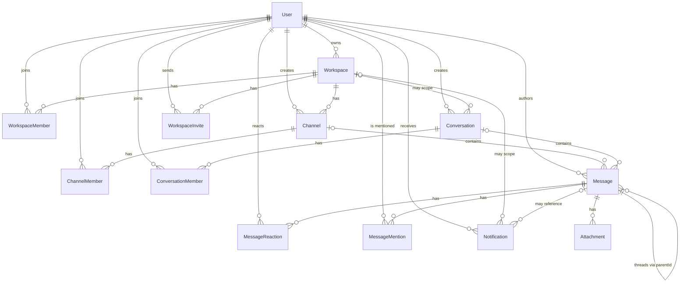

# NEURA — Database Architecture

Phase 2 of NEURA. This document explains the shape of the core collaboration
schema, why each decision was made, and what it costs.

Source of truth: [prisma/schema.prisma](../prisma/schema.prisma).
Migrations: [prisma/migrations](../prisma/migrations).

---

## 1. Entity overview

Thirteen tables across five groups.

| Group             | Tables                                                 | Purpose                                             |
| ----------------- | ------------------------------------------------------ | --------------------------------------------------- |
| **Identity**      | `users`                                                | People. No credentials — Phase 3 owns those.        |
| **Tenancy**       | `workspaces`, `workspace_members`, `workspace_invites` | The tenant boundary, its roster and its onboarding.  |
| **Containers**    | `channels`, `channel_members`, `conversations`, `conversation_members` | The two places a message can live, plus membership and read state. |
| **Content**       | `messages`, `message_reactions`, `message_mentions`, `attachments` | Everything written, and everything hanging off it.  |
| **Delivery**      | `notifications`                                        | What a user is told about.                          |

### Conventions

| Decision           | Choice                        | Reason                                                                                                |
| ------------------ | ----------------------------- | ----------------------------------------------------------------------------------------------------- |
| Primary key        | UUIDv7 (`@db.Uuid`)           | Keeps Phase 1's UUID convention, but time-ordered so inserts append to the right edge of the B-tree instead of scattering random pages. Also makes `id` a meaningful tiebreaker in cursor pagination. |
| Timestamps         | `timestamptz(3)`              | Unambiguous UTC. `timestamp` (Phase 1's default) stores no offset and silently reinterprets on a server whose timezone differs. |
| Naming             | snake_case tables and columns | Idiomatic PostgreSQL; models stay PascalCase in Prisma via `@map` / `@@map`. |
| Case-insensitivity | `citext`                      | `email`, `username`, and both slug columns. Uniqueness of `Alice` vs `alice` is enforced by the database, not by remembering to call `.toLowerCase()`. |
| Deletion           | Soft for messages             | See §7. |

---

## 2. Relationship diagram



A message points at **either** a `Channel` **or** a `Conversation` — the `|o`
cardinality on both edges reflects that only one is ever set. See §5.

---

## 3. The models

### `users`

Identity only. No password, no OAuth account, no session — Phase 3 adds those as
its own tables referencing `users.id`, which keeps the auth provider swappable.

`isActive` allows deactivation without deletion. This is not merely a
convention: `workspaces.owner_id`, `channels.created_by_id`,
`conversations.created_by_id` and `messages.author_id` are all `ON DELETE
RESTRICT`, so PostgreSQL will physically refuse to delete a user who has
authored anything.

### `workspaces` / `workspace_members`

`workspaces` is the tenant boundary. `workspace_members` carries `role`,
`status` and an optional per-workspace `nickname`. The unique constraint on
`(workspace_id, user_id)` is what makes "is this user allowed in?" a single
index probe.

`status` distinguishes `ACTIVE` / `SUSPENDED` / `LEFT`. A departing member is
marked `LEFT` rather than deleted so their historical messages still resolve to
a membership row.

### `channels` / `channel_members`

Channels are durable, workspace-scoped rooms. Slugs are unique **per workspace**
(`@@unique([workspace_id, slug])`), never globally — two workspaces may both
have `#general`.

`channel_members` is required for private channels and holds `lastReadAt`, the
anchor for unread counts. Public channels need no row per member.

`position` supports manual sidebar ordering.

### `conversations` / `conversation_members`

Direct (2 people) and group conversations. `workspaceId` is nullable so a
conversation can be workspace-scoped or cross-workspace.

`directKey` is the notable addition: for `DIRECT` rows the application stores
both participant UUIDs sorted ascending and joined with `:`. Combined with a
unique index and a CHECK constraint, this makes a duplicate DM thread between
the same two people **impossible at the database level** rather than something
the application must remember to guard with a race-prone
"find-or-create". `GROUP` rows leave it `NULL`, and PostgreSQL permits unlimited
`NULL`s in a unique index.

### `messages`

See §5 and §6.

### `message_reactions` / `message_mentions`

Reactions are unique on `(message_id, user_id, emoji)` — one user, one emoji,
one message. Mentions are extracted at write time so the "mentions me" inbox
never scans message bodies.

### `notifications`

Denormalised delivery records. `actorId` is nullable (`SYSTEM` notifications
have no actor) and `ON DELETE SET NULL`, so removing an actor blanks the
attribution instead of destroying the notification.

### `workspace_invites`

Supports both addressed invites (`email` set) and shareable links (`email`
`NULL`). `code` is globally unique. Expiry is *stored* but evaluated by the
application: a database CHECK cannot compare against `now()` in a way that stays
true over time, and a scheduled job flipping `status` to `EXPIRED` would be
noise. Treat `PENDING` + past `expiresAt` as expired at read time.

### `attachments`

Metadata only. `storageKey` is an opaque identifier owned by whichever backend
is chosen later (local disk, S3, R2); `url` caches a resolved public URL when
one exists. No upload logic, no provider SDK, no bucket assumptions.

---

## 4. Indexing strategy

Every index below exists to serve a named query. A composite index also serves
any **prefix** of its columns, so no index is duplicated by a narrower one.

| Query                                     | Index                                            | Notes |
| ----------------------------------------- | ------------------------------------------------ | ----- |
| Look up a user by handle                  | `users(email)`, `users(username)` unique          | `citext`, so case-insensitive. |
| List users chronologically                | `users(created_at)`                               | Admin and analytics views. |
| Workspaces owned by a user                | `workspaces(owner_id)`                            | PostgreSQL does **not** auto-index foreign keys. |
| **Load workspace members**                | `workspace_members(workspace_id, user_id)` unique | The uniqueness constraint doubles as the listing index via its leading column, and as the single-probe permission check. |
| **List a user's workspaces**              | `workspace_members(user_id)`                      | The reverse direction, which the composite cannot serve. |
| **Load workspace channels** (sidebar)     | `channels(workspace_id, position)`                | Returns rows already in display order — no sort node. |
| Recently created channels                 | `channels(workspace_id, created_at)`              | |
| Channel slug resolution                   | `channels(workspace_id, slug)` unique             | |
| **Load channel messages** (cursor page)   | `messages(channel_id, created_at, id)`            | See below. |
| **Load DM/group messages** (cursor page)  | `messages(conversation_id, created_at, id)`       | Same access path for the other container. |
| A user's message history                  | `messages(author_id, created_at)`                 | Profile views, moderation. |
| **Load thread replies**                   | `messages(parent_id, created_at)`                 | Also the FK index that keeps a cascading thread delete cheap. |
| **Load reactions for a message**          | `message_reactions(message_id, user_id, emoji)` unique | Leading column serves the listing; no separate `message_id` index. |
| Mentions of me                            | `message_mentions(user_id, created_at)`           | |
| **Unread notification badge**             | `notifications(user_id, is_read, created_at)`     | `is_read` sits in the middle so the index filters *and* returns rows pre-sorted. |
| **Full notification feed**                | `notifications(user_id, created_at)`              | Not redundant: the index above cannot produce a `created_at` ordering spanning both `is_read` values without a sort. |
| Invite redemption                         | `workspace_invites(code)` unique                  | |
| Pending invites for a workspace           | `workspace_invites(workspace_id, status)`         | Leading column also serves the unfiltered listing. |
| Attachments for a message page            | `attachments(message_id)`                         | |

### Cursor pagination

Message history is read newest-first and paginated by **seek**, never by
`OFFSET` — offset pagination re-scans every skipped row and shifts under
concurrent inserts, which is exactly wrong for a live chat feed.

```sql
SELECT * FROM messages
WHERE channel_id = $1
  AND (created_at, id) < ($2, $3)   -- the cursor
ORDER BY created_at DESC, id DESC
LIMIT 50;
```

`(channel_id, created_at, id)` matches this predicate exactly. `id` is in the
index because `created_at` is not unique: two messages posted in the same
millisecond would otherwise have no stable order, and a page boundary landing
between them would drop or duplicate a row. Because ids are UUIDv7, that
tiebreaker is also chronological.

The index is declared ascending; PostgreSQL scans a B-tree backwards at the same
cost, so `DESC` queries need no separate index.

### Indexes deliberately *not* created

- **Foreign keys on `notifications` (`message_id`, `actor_id`, `workspace_id`).**
  These are only needed to speed up cascading deletes of rarely-deleted parents.
  Adding three more indexes to the highest-insert-rate table after `messages`
  costs more on every write than it saves.
- **Message full-text search.** Deferred until search is a real requirement, at
  which point a GIN index on `to_tsvector(content)` is the answer. Adding it now
  would slow every insert for a feature nothing uses.
- **`workspace_invites(email)`.** Becomes worthwhile when Phase 3 matches
  pending invites during signup.

---

## 5. Message architecture

### Why one unified table

A message may live in a channel or in a conversation. The alternative —
`channel_messages` and `conversation_messages` — was rejected because every
downstream concern would have to be duplicated:

- `reactions`, `mentions`, `attachments`, and `notifications` would each need
  two nullable foreign keys, or two tables of their own.
- Threading would need two self-relations.
- "Everything this user wrote" becomes a `UNION` across two tables with a merge
  sort, instead of one index scan.
- Search, moderation and export would each be written twice.

One table costs two nullable columns. Two tables cost duplication in six places.

### The container invariant

The risk of the unified table is a row that belongs to both containers, or
neither. That is prevented in the database, not in application code:

```sql
ALTER TABLE "messages"
  ADD CONSTRAINT "messages_container_check" CHECK (
    ("channel_id" IS NOT NULL AND "conversation_id" IS NULL)
    OR
    ("channel_id" IS NULL AND "conversation_id" IS NOT NULL)
  );
```

Prisma's schema language has no CHECK syntax, so this lives as hand-written SQL
at the end of
[`20260905160000_neura_core_schema/migration.sql`](../prisma/migrations/20260905160000_neura_core_schema/migration.sql).
Prisma's introspection ignores CHECK constraints, so it survives future
`prisma migrate dev` runs untouched — but it must be re-declared if the table is
ever recreated from scratch.

Verified behaviour: inserting with both columns set, or with neither, is
rejected by PostgreSQL.

---

## 6. Thread architecture

Threads are a self-relation: `messages.parent_id` → `messages.id`. `NULL` means
top-level; any other value makes the row a reply to that root.

This is a deliberate one-level model. Replies to replies are stored flat against
the same root, matching how Slack threads behave, and avoiding recursive CTEs on
the hottest read path. Nothing in the schema prevents deeper nesting later; the
constraint is a product decision the application enforces.

A second CHECK prevents the degenerate case:

```sql
CHECK ("parent_id" IS NULL OR "parent_id" <> "id")
```

**Not enforced in the database:** that a reply lives in the same container as
its root. Expressing it would require either a trigger or denormalising the
container onto every reply and adding a composite foreign key — both meaningfully
more fragile than the invariant is worth. The application sets `channelId` /
`conversationId` from the parent when creating a reply. This is a conscious
trade, recorded in §10.

---

## 7. Soft deletion

Only `messages` are soft-deleted, via `isDeleted` + `deletedAt`. A deleted
message keeps its row so that:

- replies still resolve to a parent,
- reply counts stay correct,
- reactions and mentions do not dangle,
- moderation retains an audit trail.

Reads must filter `isDeleted = false` (or render a tombstone). This is the
schema's sharpest edge: **the database will not do it for you.** Phase 4 should
centralise message reads behind `features/messages/server/` so the filter is
written once.

Everything else deletes for real, governed by an explicit policy:

| Policy       | Applies to                                                                     | Rationale                                                     |
| ------------ | ------------------------------------------------------------------------------ | ------------------------------------------------------------- |
| `RESTRICT`   | Authorship of durable content: workspace owner, channel creator, conversation creator, message author | Makes "users are deactivated, never deleted" a database guarantee. |
| `CASCADE`    | Membership and derived records: members, reactions, mentions, attachments, notifications, invites | These have no meaning without their parent.                    |
| `SET NULL`   | `notifications.actor_id`                                                        | Blanks attribution without destroying the notification.        |

Deleting a channel therefore deletes its messages, and with them their
reactions, mentions, attachments and notifications — verified end to end.

---

## 8. Future permission extension

Today authority is the `WorkspaceRoleType` enum on `workspace_members.role`.
Five roles, one column, one index probe. A full RBAC system (roles table,
permissions table, role-permission join, member-role join) would be four tables
and three joins on the hottest authorisation path, serving zero current
requirements.

The enum is not a dead end. The migration path, when granular permissions are
actually needed:

1. Add `workspace_roles` (`id`, `workspace_id`, `name`, `permissions` as a
   `jsonb` bitmask or string array).
2. Add a **nullable** `workspace_members.custom_role_id` → `workspace_roles.id`.
3. Resolve permissions as `custom_role_id ?? role`.

Every step is additive. No existing column changes type, no relation is
rewritten, no data migration is required, and rows that never adopt a custom
role keep working unchanged. That is the property worth protecting — not
building the tables early.

---

## 9. Known tradeoffs

1. **Soft-deleted messages are not filtered by the database.** Every read path
   must exclude `isDeleted = true`. Mitigation: centralise message reads in one
   module. A PostgreSQL row-level-security policy or a view could enforce it, at
   the cost of making Prisma's generated client less direct.
2. **Cross-container thread integrity is application-enforced.** A reply could
   in principle be written into a different channel than its root. Enforcing it
   in the database requires a trigger or a denormalised composite FK; neither
   earns its complexity yet (§6).
3. **`directKey` must be computed correctly by the application.** The database
   guarantees uniqueness and presence, but cannot verify the key actually
   matches the conversation's two members. A trigger could; it would run on
   every DM creation.
4. **No message search index.** Deferred deliberately (§4). Adding a GIN index
   later is a one-line migration and a `CONCURRENTLY` build.
5. **`messages` will need partitioning eventually.** At 20k DAU the table grows
   by millions of rows per year. The `(channel_id, created_at, id)` index keeps
   reads flat, but range-partitioning by `created_at` will eventually help
   vacuum and retention. The schema is partition-ready: `created_at` is on every
   row and the primary key is time-ordered. Not needed now, and premature
   partitioning would complicate every query today.
6. **Enum changes require a migration.** Adding a `WorkspaceRoleType` value is
   `ALTER TYPE ... ADD VALUE`. That is the intended friction — roles should not
   be added casually.
7. **UUIDv7 leaks creation time.** Ids embed a millisecond timestamp. For this
   platform that is already public (`createdAt` is returned with every message),
   but it means ids should not be treated as opaque secrets. Invite `code` is a
   separate, non-UUID column precisely for that reason.
8. **`attachments.size` is `INTEGER`** — a 2.1 GB per-file ceiling. Deliberate;
   revisit if large media uploads are ever in scope.

---

## 10. Migrations

| Migration                       | Contents                                                                 |
| ------------------------------- | ------------------------------------------------------------------------ |
| `20260905144125_init`           | Phase 1 placeholder `users` table. **Amended in Phase 2** to create the `citext` and `pgcrypto` extensions itself. |
| `20260905160000_neura_core_schema`    | Six enums, twelve new tables, the `users` reshape, all indexes and foreign keys, plus three hand-written CHECK constraints. |

### Migration naming

Prisma orders migrations by the **numeric timestamp prefix** of the directory
name, not by string comparison. A short prefix therefore sorts *before* every
full-length one from the same day: `20260905` is a smaller number than
`20260905144125`, so a directory named `20260905_neura_core_schema` would run
ahead of `20260905144125_init` and fail on a fresh database with
`relation "users" does not exist`.

Always use the full `YYYYMMDDHHMMSS` prefix. This bites only on a fresh deploy —
an existing database has the earlier migration already recorded and skips it, so
the fault stays hidden in development until CI or production replays history
from empty.

### Why the Phase 1 migration was amended

It used the `CITEXT` type while relying on the docker-compose init script to
have created the extension. That script only runs on the main database when its
volume is first created — so the migration failed on any *other* fresh database,
including the shadow database Prisma creates for drift detection, and would have
failed in CI and production. Moving `CREATE EXTENSION IF NOT EXISTS` into the
migration makes the migration history self-sufficient everywhere. The
docker-compose init script is now redundant but harmless, and is kept so a
database provisioned outside Prisma still gets the extensions.

### Running migrations

```bash
npm run infra:up      # PostgreSQL + Redis
npm run db:migrate    # development: create and apply
npm run db:deploy     # production/CI: apply only
npx prisma migrate status
```

### Seed data

None. There is no seed script and no demo data, by design — nothing in the
schema requires bootstrap rows, and a seed script would need a TypeScript
runner as a new dependency. Phase 3 may add a dev-only seed once real fixtures
(a user, a workspace, a channel) become useful for local work.
